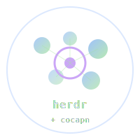

# herdr-cocapn

> **herdr + cocapn-core: agent multiplexer meets fleet management.**

<p align="center">
  
</p>

<p align="center">
  <a href="#what">what is this</a> ·
  <a href="#why-cocapn">why cocapn</a> ·
  <a href="#quick-start">quick start</a> ·
  <a href="#fleet-management">fleet management</a> ·
  <a href="#code-examples">code examples</a>
</p>

---

## What

Herdr is a terminal multiplexer purpose-built for AI coding agents. It gives you workspaces, tabs, panes, agent awareness in the sidebar, detach/reattach — all in your terminal, no Electron, no GUI.

CoCapn is a distributed agent framework with a layered device model: **Reflex → Backbone → Cortex → Cloud**, deadband triggers for when values drift, crossfade handoffs for smooth transitions between devices, and a push-down principle that says intelligence should run on the cheapest hardware that can handle it.

**herdr-cocapn** is the fork that marries them. Herdr already runs your agents. Now it manages them like a fleet.

## 🗺️ The Map

herdr-cocapn maps CoCapn's device tiers directly onto herdr's agent model:

| CoCapn Tier  | herdr Model   | Examples                      | Cost   |
|-------------|---------------|-------------------------------|--------|
| **Reflex**  | `Local`       | Ollama, llama.cpp, local LMs  | Free   |
| **Backbone**| `Hybrid`      | Pilot + local agent           | Cheap  |
| **Cortex**  | `Cloud`       | Claude Code, Codex, GPT, etc. | $/use  |
| **Cloud**   | Cloud API     | Heavy inference, large models | $$$    |

When your local agent is struggling with 12 pending tasks and hitting completion timeouts, herdr-cocapn detects it via **deadband** and auto-escalates to a cloud agent — while the cloud agent is crossfading in, the local agent keeps working so nothing drops.

When the cloud agent hits 120 seconds of idle, **the fleet de-escalates** back to the local agent. You're not paying API costs for an agent that's waiting on you.

## ⚡ Quick Start

```bash
# Install herdr (upstream)
curl -fsSL https://herdr.dev/install.sh | sh

# This fork adds cocapn-core fleet management as a built-in module.
# The workflow is identical to stock herdr — fleet management
# runs automatically in the background.
herdr
```

Then in your workspace:

```bash
# Run a local model in one pane
ollama run deepseek-coder

# Run Claude Code in another
claude

# herdr-cocapn detects both, registers them in the fleet,
# and watches their health via deadbands. Pending tasks,
# completion times, and idle periods are all monitored.
```

## ⚙️ Fleet Management

The fleet module (`src/fleet/`) is the bridge between herdr and cocapn-core. It's a pure Rust module with no additional runtime dependencies beyond cocapn-core itself.

### Agent Registration

Every herdr pane that runs an AI agent is treated as a **FleetAgent** with a device tier, capabilities, and live metrics.

```rust
use herdr::fleet::{Fleet, FleetAgent, AgentModel};

let mut fleet = Fleet::new();

// Register local agents (Reflex tier)
fleet.register_agent(FleetAgent::new("pane-1", "codex-a", AgentModel::Local));
fleet.register_agent(FleetAgent::new("pane-2", "codex-b", AgentModel::Local));

// Register a cloud agent (Cortex tier)
fleet.register_agent(FleetAgent::new("pane-3", "claude", AgentModel::Cloud));
```

### Deadband Overload Detection

Deadbands are the universal trigger. They answer one question: **"has this value drifted far enough to warrant action?"**

```rust
use herdr::fleet::{AgentMetrics, AgentHealth, FleetAgent, AgentModel};

let mut agent = FleetAgent::new("pane-1", "codex-local", AgentModel::Local);

// Simulate metrics update — 12 pending tasks triggers overload
let metrics = AgentMetrics {
    pending_tasks: 12,       // above threshold → Overloaded
    avg_completion_secs: 45.0,
    errors_last_interval: 0,
    is_generating: true,
    idle_seconds: 0.0,
};

match agent.update_metrics(metrics) {
    AgentHealth::Overloaded => println!("⬆️ Escalating to cloud..."),
    AgentHealth::Idle => println!("💤 Cost saving: de-escalate to local"),
    AgentHealth::Healthy => println!("✅ Agent performing normally"),
    AgentHealth::Strained => println!("⚡ Agent nearing capacity"),
}
```

### Escalation Pipeline

When agents are overloaded, the fleet evaluates and takes action:

```rust
use herdr::fleet::EscalationAction;

// After updating metrics on all agents:
let actions = fleet.evaluate_and_escalate();

for action in &actions {
    match action {
        EscalationAction::EscalateToCloud { target_pane, reason } => {
            println!("→ Handing off to {}: {}", target_pane, reason);
            fleet.begin_handoff("pane-1", target_pane)?;
        }
        EscalationAction::ProvisionCloudAgent { agent_type, reason } => {
            println!("→ Launching {}: {}", agent_type, reason);
            // herdr starts a new pane with `claude` (or whatever agent_type)
        }
        EscalationAction::DeEscalateToLocal { target_pane } => {
            println!("→ De-escalating to {} (saving cost)", target_pane);
            fleet.begin_handoff("pane-3", target_pane)?;
        }
        _ => {}
    }
}
```

### Crossfade Handoff

When control passes between agents, it doesn't snap — it crossfades, like a DJ transitioning between tracks.

```
States: Stable → FadingOut → Crossfading → FadingIn → Complete

Local agent:   ████████████░░░░░░░░░░  (fading out)
Cloud agent:   ░░░░░░░░░░████████████  (fading in)
Time:          [0s]──[2s]──[4s]──[6s]
```

```rust
use std::time::Duration;

// Begin the transition
fleet.begin_handoff("pane-1", "pane-3")?;

// Tick the handoff — each call advances the blend
for _ in 0..10 {
    let completed = fleet.tick_handoffs(Duration::from_millis(600));
    if !completed.is_empty() {
        println!("✅ Handoff complete: {}", completed[0]);
        break;
    }
}
```

### Push-Down Evaluation

The push-down principle: run features on the cheapest tier that supports them.

```rust
use cocapn_core::{
    device::DeviceTier,
    pushdown::{FeatureSpec, ComputeClass},
};

let features = vec![
    FeatureSpec {
        name: "code_review".into(),
        min_tier: DeviceTier::Reflex,     // local can do this
        memory_bytes: 100_000,
        compute_estimate: ComputeClass::Trivial,
    },
    FeatureSpec {
        name: "complex_refactoring".into(),
        min_tier: DeviceTier::Backbone,    // needs more RAM
        memory_bytes: 500_000_000,
        compute_estimate: ComputeClass::Light,
    },
];

// See what runs where
let results = fleet.compute_pushdown(&features);
// Reflex → 1 feature (code_review)
// Backbone → 2 features (both)
```

### Fleet Summary

Get a snapshot of the entire agent fleet at a glance:

```rust
let summary = fleet.summary();
println!("{}", summary);
// ── herdr-cocapn Fleet ──
//   Agents: 2/3 healthy
//   Overloaded: 1  Idle: 0
//   Active tier: Cortex
//   Handoffs: 1  Escalations pending: 0
//   Backlog: 0 items
//   By tier:
//     Reflex: 2 agent(s)
//     Cortex: 1 agent(s)
```

## 🏗️ Architecture

```
┌──────────────────────────────────────────────────────┐
│                    herdr (terminal UI)                │
│  ┌─────────┐  ┌─────────┐  ┌─────────┐  ┌─────────┐ │
│  │ pane-1  │  │ pane-2  │  │ pane-3  │  │ pane-4  │ │
│  │ codex-a │  │ codex-b │  │ claude  │  │ ollama  │ │
│  │  Local  │  │  Local  │  │  Cloud  │  │  Local  │ │
│  └────┬────┘  └────┬────┘  └────┬────┘  └────┬────┘ │
│       │            │            │            │       │
├───────┴────────────┴────────────┴────────────┴───────┤
│              herdr-cocapn Fleet Module                │
│                                                       │
│  ┌───────────────────────────────────────────────┐   │
│  │              Deadband Monitors                 │   │
│  │  pending_tasks > 5 → Overloaded                │   │
│  │  idle_seconds > 60 → Idle                      │   │
│  │  errors/interval > 3 → Unhealthy               │   │
│  └───────────────────┬───────────────────────────┘   │
│                      │                                │
│  ┌───────────────────▼───────────────────────────┐   │
│  │         Escalation Engine                      │   │
│  │  Reflex overloaded ↦ find/provision Cortex    │   │
│  │  Cortex idle ↦ de-escalate to Reflex          │   │
│  └───────────────────┬───────────────────────────┘   │
│                      │                                │
│  ┌───────────────────▼───────────────────────────┐   │
│  │         Crossfade Handoff                      │   │
│  │  Stable → FadingOut → Crossfading → Complete  │   │
│  └───────────────────┬───────────────────────────┘   │
│                      │                                │
├──────────────────────┴────────────────────────────────┤
│                  cocapn-core (primitives)              │
│  DeviceTiers · Deadbands · Handoffs · Stripe · Push   │
└───────────────────────────────────────────────────────┘
```

## 🔧 Building

```bash
# Clone the fork
git clone https://github.com/SuperInstance/herdr-cocapn.git
cd herdr-cocapn

# Check dependencies
# Requires: Rust 1.80+, Zig 0.15.2+ (for vendored libghostty-vt)

# Quick check (skips vendored build)
SKIP_VENDORED_BUILD=1 cargo check

# Full build
# cargo build

# Run the fleet demo
SKIP_VENDORED_BUILD=1 cargo run --example fleet
```

## 📦 Dependencies

| Dependency | Purpose | Source |
|-----------|---------|--------|
| `cocapn-core` | Device tiers, deadbands, handoffs, stripe, pushdown | Local crate |
| `portable-pty` | PTY abstraction | Upstream |
| `ratatui` | Terminal UI framework | Upstream |

All herdr upstream dependencies are preserved. This fork adds `cocapn-core` as the only new dependency.

## 🔗 Related

- [cocapn-core](https://github.com/SuperInstance/cocapn-core) — The CoCapn core types used by this fork
- [herdr](https://herdr.dev) — Original herdr project
- [CoCapn README](https://github.com/SuperInstance/cocapn-core#readme) — Full CoCapn architecture docs

## 📜 License

AGPL-3.0-or-later (as inherited from herdr). CoCapn primitives are MIT.
